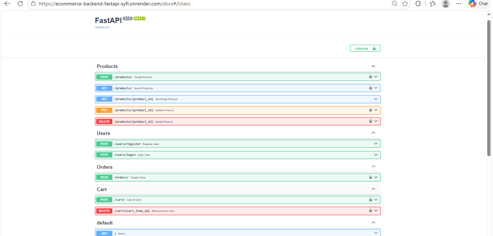
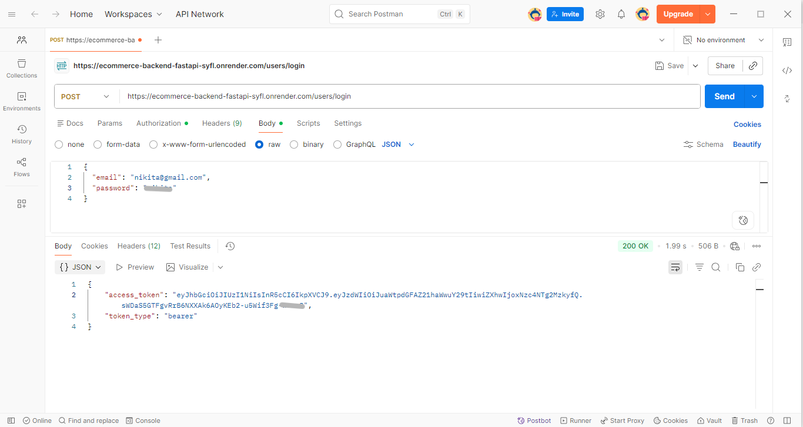
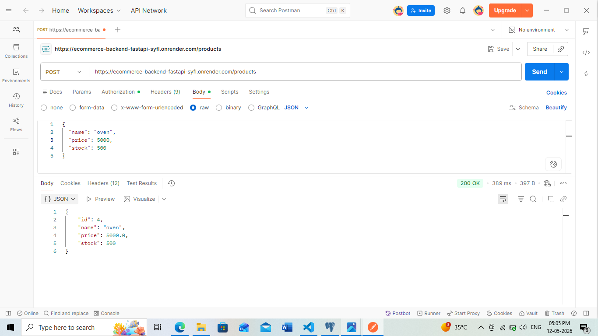
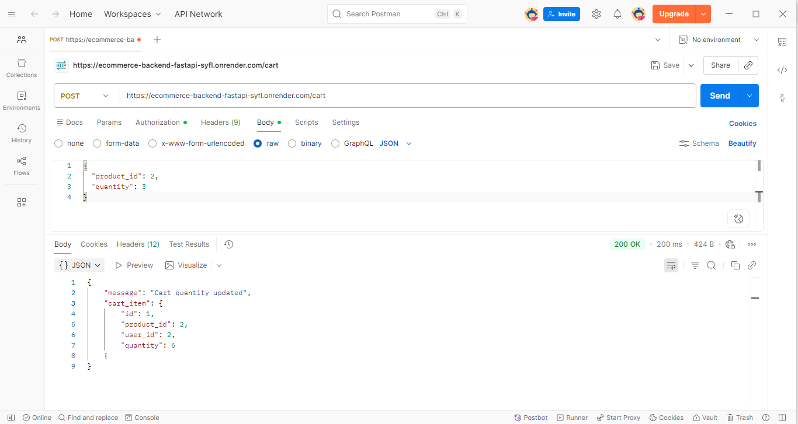
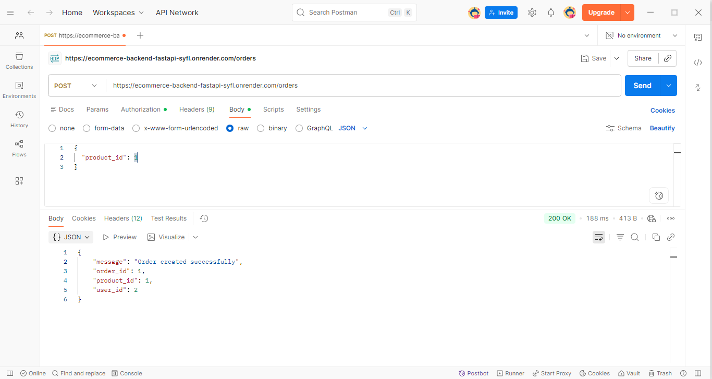

# Ecommerce Backend API

A production-style Ecommerce Backend API built using FastAPI, PostgreSQL, SQLAlchemy, and JWT Authentication.

The project includes authentication, role-based access control (RBAC), product management, cart functionality, order management, and product search/filtering.

---

# Live Deployment

Deployed API:

[https://ecommerce-backend-fastapi-syfl.onrender.com](https://ecommerce-backend-fastapi-syfl.onrender.com)

Swagger Docs:

[https://ecommerce-backend-fastapi-syfl.onrender.com/docs](https://ecommerce-backend-fastapi-syfl.onrender.com/docs)

---

# Features

## Authentication & Authorization

* User Registration
* User Login
* JWT Authentication
* Protected Routes
* Role-Based Access Control (RBAC)
* Admin-only Product Management

## Product Management

* Create Product
* Get All Products
* Product Search & Filtering
* Update Product
* Delete Product

## Cart System

* Add Products to Cart
* Quantity Management
* Prevent Duplicate Cart Entries
* Remove Items from Cart
* User-specific Cart Access

## Orders

* Place Orders
* Product-to-User Relational Mapping
* Authenticated Order Workflow

---

# Tech Stack

* FastAPI
* PostgreSQL
* SQLAlchemy ORM
* Pydantic
* JWT Authentication
* Uvicorn
* Render Deployment
* Postman
* pgAdmin4

---

# Project Structure

```bash
app/
│
├── db/
│   └── database.py
│
├── models/
│   ├── user.py
│   ├── product.py
│   ├── order.py
│   └── cart.py
│
├── routes/
│   ├── user_routes.py
│   ├── product_routes.py
│   ├── order_routes.py
│   └── cart_routes.py
│
├── schemas/
│   ├── user_schema.py
│   ├── product_schema.py
│   ├── order_schema.py
│   └── cart_schema.py
│
├── utils/
│   ├── hashing.py
│   └── oauth2.py
│
└── main.py
```

---

# API Endpoints

## User Routes

| Method | Endpoint        | Description   |
| ------ | --------------- | ------------- |
| POST   | /users/register | Register user |
| POST   | /users/login    | Login user    |

---

## Product Routes

| Method | Endpoint                | Description            |
| ------ | ----------------------- | ---------------------- |
| GET    | /products               | Get all products       |
| GET    | /products?search=laptop | Search products        |
| POST   | /products               | Create product (Admin) |
| PUT    | /products/{id}          | Update product         |
| DELETE | /products/{id}          | Delete product         |

---

## Cart Routes

| Method | Endpoint   | Description           |
| ------ | ---------- | --------------------- |
| POST   | /cart      | Add item to cart      |
| DELETE | /cart/{id} | Remove item from cart |

---

## Order Routes

| Method | Endpoint | Description |
| ------ | -------- | ----------- |
| POST   | /orders  | Place order |

---

# Environment Variables

Create a `.env` file in the project root:

```env
DATABASE_URL=your_database_url
SECRET_KEY=your_secret_key
```

---

# Installation & Setup

## Clone Repository

```bash
git clone https://github.com/bhandari-nikita/ecommerce-backend-fastapi.git
```

## Navigate to Project

```bash
cd ecommerce-backend-fastapi
```

## Create Virtual Environment

```bash
python -m venv venv
```

## Activate Virtual Environment

### Windows

```bash
venv\Scripts\activate
```

### Linux / Mac

```bash
source venv/bin/activate
```

## Install Dependencies

```bash
pip install -r requirements.txt
```

## Run Server

```bash
uvicorn app.main:app --reload
```

---

# Authentication Flow

1. Register User
2. Login User
3. Receive JWT Access Token
4. Add Bearer Token in Protected Requests
5. Access Protected APIs

---

# Database Relationships

* One User → Many Orders
* One Product → Many Orders
* One User → Many Cart Items
* One Product → Many Cart Items

---

# Future Improvements

* Payment Integration
* Order History Endpoint
* Docker Support
* CI/CD Pipeline
* Unit Testing

---

# Screenshots

## Swagger Documentation



---

## User Login & JWT Authentication



---

## Product Creation



---

## Cart Workflow



---

## Order Workflow



---


# Author

Nikita Bhandari
